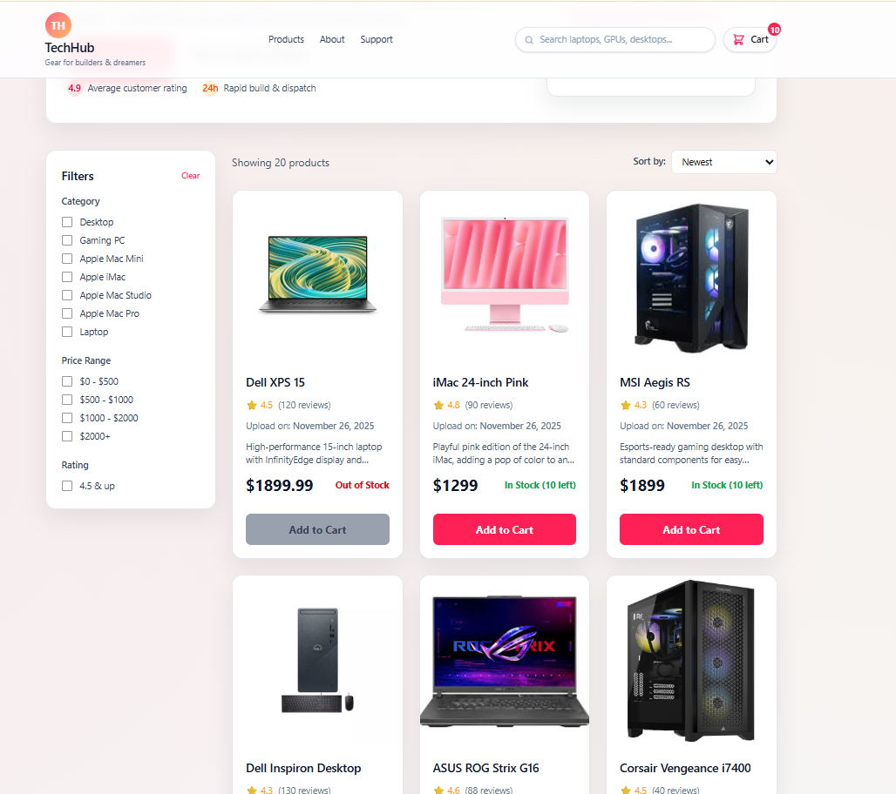
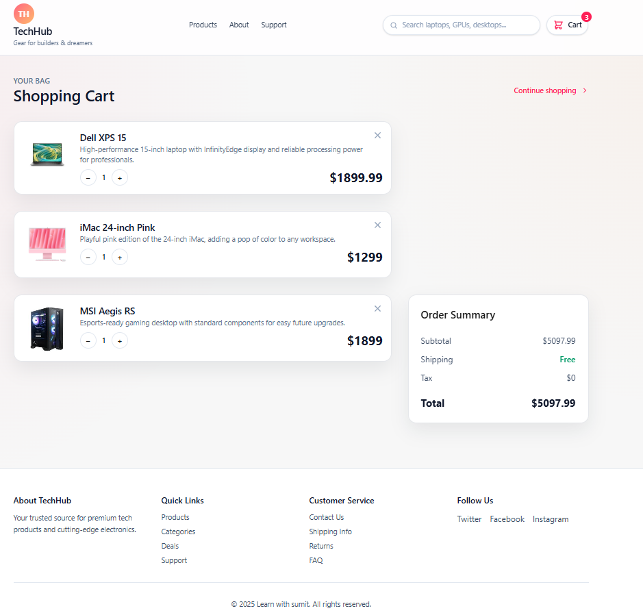

# TechHub — E-Commerce Product Dashboard

[Live Demo](https://assignment-4-peyal.vercel.app/) | [GitHub Repo](https://github.com/peyalhasan/Assignment-4)

---


## 🛒 Project Overview
TechHub is a modern, responsive e-commerce product dashboard built with **React + Vite**.  
It includes product listing, server-side filtering, sorting, search, and a full shopping cart system with quantity control and order summary.

---

## 📁 Project Structure

```
Main
└── App
└── Page
├── Header
│ ├── Logo
│ ├── Search
│ ├── Cart
├── Hero
├── TechBoard
│ └── CartsBoard
└── Dashboard
├── Sidebar
├── Sort
└── ProductBoard
```


---

## ✨ Features
- Product listing with pricing, stock status, rating, and details  
- Category, price, and rating filters  
- Sorting (Newest / Price High–Low / Price Low–High)  
- Debounced Search  
- Add to Cart, Increase / Decrease quantity, Remove item  
- Live price calculation  
- Order Summary (subtotal, shipping, tax)  
- Loading & Error UI  
- Beautiful clean UI  
- Fully responsive

---

## 🛠 Tech Stack
- React  
- Vite  
- Tailwind CSS  
- React Router  
- Custom Hooks  
- JSON API  
- Vercel Deployment

---

## 📥 Installation & Run
```bash
# Clone the repo
git clone https://github.com/peyalhasan/Assignment-4.git

# Move into project folder
cd Assignment-4

# Install dependencies
npm install

# Start development server
npm run dev
```

## 🧩 Custom Hooks

### `useProducts()`
- Fetch products
- Apply filters & sorting
- Handle loading/error
- Provide final product list

### `useCategories()`
- Fetch category list
- Handle loading/error

---

## 📸 Screenshots

### Component Tree


### Products Board


### Cart Page


> **Tip:** Place your images in the `/assets` folder and replace the filenames above.

---

## ⚠️ Notes
- All filtering is **server-side**
- Search is **server-side**
- No environment variables needed
- Works perfectly on **Vercel**

---

## 🧾 License
This project is created for **LWS Assignment-4**.  
Free to use for educational purposes.

---

## 👤 Author
**Peyal Hasan**  
GitHub: [https://github.com/peyalhasan](https://github.com/peyalhasan)
